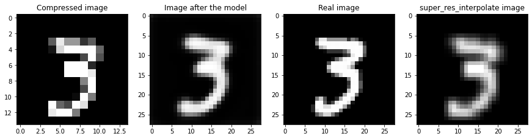

In this repository you will find some notebooks specialized on computer vision tasks with deep learning.

# In Super_Resolution_CNN.ipynb 
you'll find an implementation of the paper  
 Chao Dong, Chen Change Loy, Kaiming He, Xiaoou Tang. Learning a Deep Convolutional Network for Image Super-Resolution, in Proceedings of European Conference on Computer Vision (ECCV), 2014
on MNIST

## Results : 
  Compressed image | Image in output of the model | Real image | interpolation algorithm image

  

# In PlayingWithGradient.ipynb 
You'll find some works on gradient with neural networks.
First we try to visualize the role of filters by reproducing the Deep Dream algorithm.

Then we try to make adversarial example, i.e. images that are misclassified but humans still can choose the right class.

